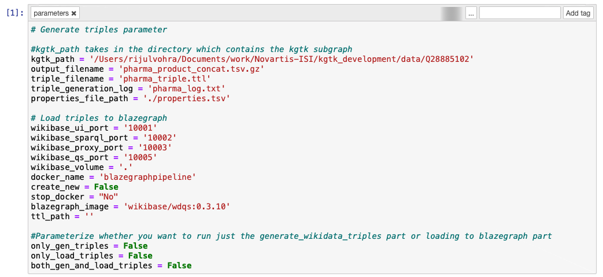

# blazegraph-load-pipeline
Pipeline to generate triples aligning to Wikidata Schema for any KGTK graph and loading the created triples to Blazegraph

**Steps to run the pipeline**

* Create a new conda environment

  ```bash
  conda create --name kgtk_env python=3.7
  ```

* Activate the newly created environment

  ```bash
  conda activate kgtk_env
  ```

* Install Dependencies

  ```bash
  pip install -r requirements.txt
  ```

**Pipeline 1**

The first pipeline is to generate wikidata triples for any KGTK subgraph. The pipeline can be run as a jupyter notebook using <em>papermill</em>. The pipeline would take the following parameters from the user:

```
kgtk_path: directory which contains the KGTK edge files
output_filename: the filename for the concatenated KGTK edge files
triple_filename: the name of the output triple file with .ttl extension
triple_generation_log: the name of the file to which the logs should be written
properties_file_path: the path for the properties file(In this repo the Wikidata properties file is present in the notebooks directory)
```

**Default parameters that the notebook takes**



**Example Command for running the notebook**

```bash
papermill pipeline_triple_generation.ipynb pipeline_chemical_op.ipynb -p kgtk_path ../data/Q11173 -p output_filename chem_concat_2.tsv.gz -p triple_filename chem_triple_2.ttl -p triple_generation_log chem_log.txt -p properties_file_path ./properties.tsv
```

**Pipeline 2**

The second pipeline is for loading the triples to a Blazegraph triple store and have a SPARQL endpoint deployed for querying the Blazegraph.

This part of the pipeline is a python script and the arguments that it will take are:

```bash
usage: blazegraph_load.py [-h] [--wikibase_ui_port WIKIBASE_UI_PORT]
                          [--wikibase_sparql WIKIBASE_SPARQL]
                          [--wikibase_proxy WIKIBASE_PROXY]
                          [--wikibase_qs WIKIBASE_QS]
                          [--wikibase_volume WIKIBASE_VOLUME]
                          [--create_new CREATE_NEW]
                          [--docker_name DOCKER_NAME]
                          [--stop_docker_container STOP_DOCKER_CONTAINER]
                          ttl_path

positional arguments:
  ttl_path              Path of the ttl file that needs to be loaded

optional arguments:
  -h, --help            show this help message and exit
  --wikibase_ui_port WIKIBASE_UI_PORT
                        Port on which wikibase UI should run
  --wikibase_sparql WIKIBASE_SPARQL
                        Port on which wikibase SPARQL should run
  --wikibase_proxy WIKIBASE_PROXY
                        Port on which wikibase proxy should run
  --wikibase_qs WIKIBASE_QS
                        Port on which wikibase QS should run
  --wikibase_volume WIKIBASE_VOLUME
                        Volume path on which the Blazegraph docker image
                        should be mounted
  --create_new CREATE_NEW
                        Should a new docker container be created, True or
                        False
  --docker_name DOCKER_NAME
                        Name the docker container
  --stop_docker_container STOP_DOCKER_CONTAINER
                        To stop custom docker, pass the port numbers as well.
                        If used standalone, it will stop the default running
                        docker
```


**Dependencies**

1. The scripts in here are dependent on [KGTK](https://github.com/usc-isi-i2/kgtk). The present release of the package might break on some edge case tsv files. Hence to ensure, that it does not break on those edge cases, make sure to install KGTK from <em>dev</em> branch.

2. It is also dependent on [rdflib](https://github.com/RDFLib/rdflib). Do not use the present release (5.0.0) of rdflib. Install it from the <em>master</em> branch.

Note: I'll update the readme when the new versions of both the libraries are released.

   

