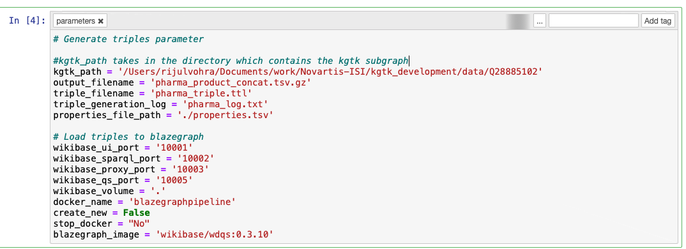

# Blazegraph Load Pipeline

Create a new conda environment.

```bash
conda create --name kgtk_env python=3.7
```

Activate the newly created environment

```bash
conda activate kgtk_env
```

### Install dependencies

```bash
pip install -r requirements.txt
```

### Generating Triples and loading the triples to Blazegraph instance

The automated pipeline for generating triples and loading triples to blazegraph is written in jupyter notebook.

**Parameters that the notebook takes**




**Note:** 

* Make sure that your Docker Daemon is running before you start running this pipeline.

* If you are running the blazegraph docker on a small subgraph, then the default Blazegraph image would work fine. If you are running the blazegraph docker to load a large subgraph on a large server then pass the **blazegraph_image** parameter as **rijboy/blazegraph-load**

**Example Command**

```python
papermill combined_pipeline.ipynb pharma_op.ipynb -p kgtk_path /Users/rijulvohra/Documents/work/Novartis-ISI/kgtk_development/data/Q28885102 -p output_filename pharma_combined_concat.tsv.gz -p triple_filename pharma_combined_triple.ttl -p triple_generation_log pharma_combined_log.txt -p properties_file_path ./properties.tsv -p wikibase_volume . -p create_new True -p docker_name blazegraphpipeline
```


